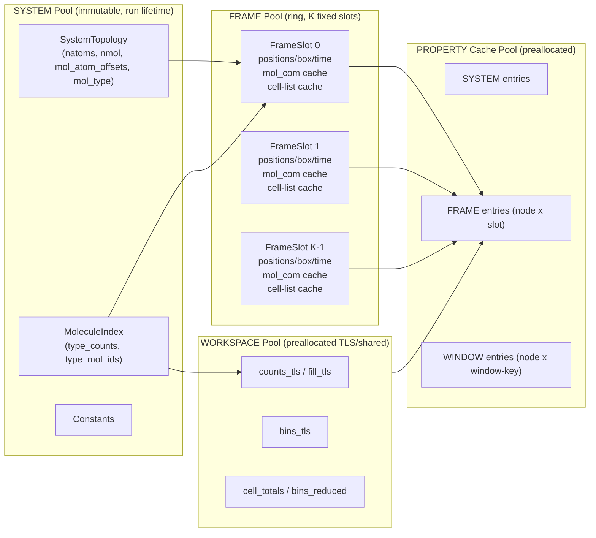
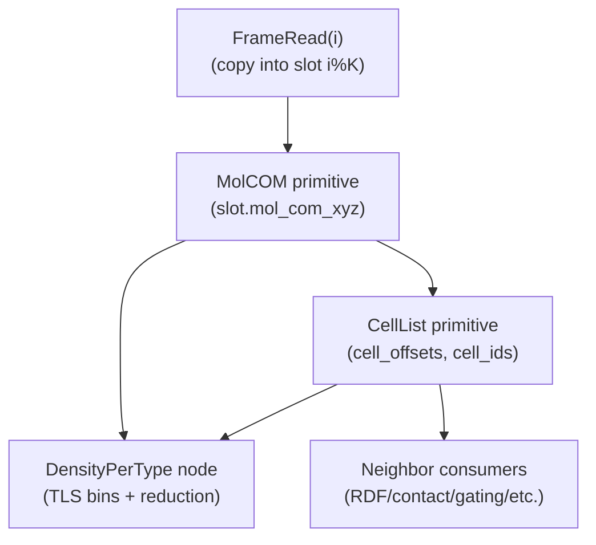
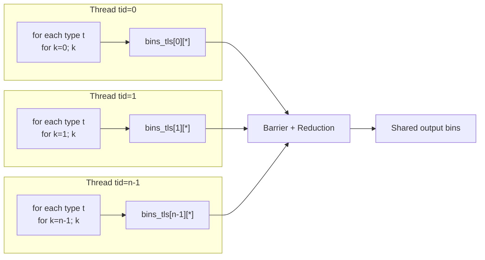

# MD Trajectory Engine Workflow Spec

This document is the implementation contract for the C-style analysis engine in this repository. It is intentionally explicit about memory ownership, cache keys, and frame-time execution so behavior is auditable and safe to extend.

## 1) Non-Negotiable Invariants

1. `FrameRing` has fixed size `K`.
2. All memory for ring slots, property outputs, and workspaces is allocated once in `scheduler_init`.
3. No `malloc/new/free` are allowed in per-frame ingest, primitive compute, or property compute.
4. New frame `i` always overwrites slot `slot = i % K`.
5. Scratch data uses only preallocated `Workspace` buffers (TLS or shared with barrier points).
6. Property nodes are pure with respect to output ownership:
   - read inputs from SYSTEM/FRAME/WINDOW pools,
   - write only to their preallocated output buffer or a preallocated frame primitive buffer.

## 2) Memory Pools, Lifetimes, and Ownership

### SYSTEM pool (immutable)
- Topology (`natoms`, `nmol`, molecule atom ranges, molecule type ids).
- Molecule index (`type_counts[t]`, `type_mol_ids[t][k]`).
- Compile/runtime constants (if needed by nodes).
- Lifetime: whole process run.

### FRAME pool (ring of `K` slots)
- Slot data: `positions_xyz`, `box`, `time_ps`, `step`, `frame_index`.
- Per-frame primitives cache in each slot:
  - `mol_com_xyz[nmol*3]`,
  - `CellList` arrays (`cell_offsets[ncells+1]`, `cell_ids[max_items]`, `mol_cell[nmol]`).
- Lifetime: allocated once, content overwritten per slot on ingest.

### PROPERTY cache pool
- Preallocated cache entries for enabled nodes with explicit scope:
  - `SYSTEM` cache (`max_nodes`),
  - `FRAME` cache (`max_nodes * K`),
  - `WINDOW` cache (`max_nodes * K`, keyed by window start/end).
- Each entry has `CacheKey` + preallocated payload storage.
- Compute-once rule: `(node_id, scope, params_hash, scope_index)` uniquely identifies reusable outputs.

### WORKSPACE pool
- TLS arrays:
  - `counts_tls[tid][cell]`,
  - `fill_tls[tid][cell]`,
  - `bins_tls[tid][bin]`.
- Shared reduction buffers:
  - `cell_totals[cell]`,
  - `bins_reduced[bin]`.
- Lifetime: whole process run, zeroed/reused per frame.

## 3) Memory Pool / Lifetime Diagram



## 4) Per-Frame Execution Algorithm

### Initialization (once)
1. Allocate all ring slots and slot-owned primitive arrays.
2. Allocate all cache entries and payload storage for enabled node set.
3. Allocate workspace TLS/shared arrays sized by `nthreads`, `ncells`, `nbins`.
4. Register property DAG nodes (name, scope, hash, deps, output spec, compute fn).

### Frame ingest (`i`)
1. `slot = i % K`.
2. Copy input positions/box/time into slot memory.
3. Mark slot primitives invalid (`mol_com_ready = 0`, `cell_list.ready = 0`).
4. Invalidate FRAME cache entries that map to `slot`.

### Property execution (`scheduler_execute_node(node_id, frame_i)`)
1. Resolve and execute dependencies first (topological recursion).
2. Build cache key using scope:
   - SYSTEM: key independent of frame.
   - FRAME: key includes exact `frame_index`.
   - WINDOW: key includes `[window_start, window_end]`.
3. If key matches valid cache entry: return cached output.
4. Else call node `compute(ctx, out)`:
   - must use only preallocated memory,
   - may request primitives (`MolCOM`, `CellList`) through ensure APIs.
5. Store cache key + mark valid.

## 5) Per-Frame DAG Example



## 6) Property Node Contract (Drop-In)

Node contract in code:

```c
typedef int (*PropertyComputeFn)(EngineContext *ctx, PropertyOutput *out);

typedef struct PropertyNode {
    uint32_t node_id;
    const char *name;
    PropertyScope scope;        // SYSTEM / FRAME / WINDOW
    uint64_t params_hash;       // hash of science/runtime params
    const uint32_t *deps;       // node ids
    uint32_t ndeps;
    OutputSpec output;          // kind + required_bytes + scope
    PropertyComputeFn compute;  // writes to preallocated memory
    void *user_data;
} PropertyNode;
```

Checklist to add a new property:
1. Define node id and node metadata (`name`, `scope`, `params_hash`).
2. Declare dependencies by node id order.
3. Define `OutputSpec.required_bytes` and output kind.
4. Ensure preallocated cache storage is large enough for this output.
5. Implement `compute(ctx, out)`:
   - no allocation,
   - use canonical per-type iteration policy,
   - write only to `out->data` or documented frame primitive buffers.
6. Register node in DAG registry.
7. Add tests validating cache reuse and slot overwrite behavior.

Auditability rule:
- Each science quantity has one owning compute function (`compute_*`) and one node name. This keeps answers to questions like “where is dipole computed?” to a single code location.

## 7) Iteration and Threading Policy

Canonical parallel loop (by type, strided by `tid`):

```c
for (uint32_t t = 0; t < idx->ntypes; ++t) {
    const uint32_t n_type = idx->type_counts[t];
    const uint32_t *mol_ids = idx->type_mol_ids[t];
    for (uint32_t k = tid; k < n_type; k += nthreads) {
        uint32_t mol = mol_ids[k];
        // per-molecule work: unique output index => no lock
    }
}
```

Reduction rule:
- For histogram/bin outputs, each thread writes to `bins_tls[tid][bin]`.
- After a barrier, reduce TLS bins into shared output.
- No atomics in hot loop.

## 8) Threading Model Diagram



## 9) Neighbor Search Primitive Spec

### Data layout (`CellList`)
- `cell_offsets[ncells+1]` (CSR offsets)
- `cell_ids[nitems]` (flat molecule ids by cell)
- optional `mol_cell[nmol]` (fast cell lookup per molecule)
- Built per frame from molecule COM or representative atom.

### Build API
- `scheduler_ensure_cell_list(ctx, frame_index)`
- Preconditions:
  - target frame exists in slot,
  - `MolCOM` is available (built on demand).
- Two-phase algorithm (no atomics):
  1. Phase A (parallel): `counts_tls[tid][cell]++`.
  2. Prefix sum: compute global `cell_offsets`.
  3. Compute per-thread base offsets from prefix + TLS counts.
  4. Phase B (parallel): fill `cell_ids` via `fill_tls[tid][cell]++`.

### Query API
- `cell_list_query_neighbors(slot, ref_mol, cutoff, policy, visitor, user)`
- Iterates adjacent cells around `ref_mol` cell.
- Applies distance policy with anisotropic periodic flags (`periodic[x,y,z]` can differ).
- Calls visitor callback for pairs inside cutoff.

Distance policy requirements:
- Minimum-image correction only on periodic axes.
- Non-periodic axes use direct difference.

## 10) Version-Controlled Implementation Workflow

1. Update this spec first (`docs/workflow.md`) when introducing architecture changes.
2. Add/modify structs in `include/engine_types.h`.
3. Implement scheduler/primitive/property changes in `src/scheduler.c` (or split files later).
4. Build and run compile checks before commit.
5. Commit spec + code together so history preserves design intent with implementation.
